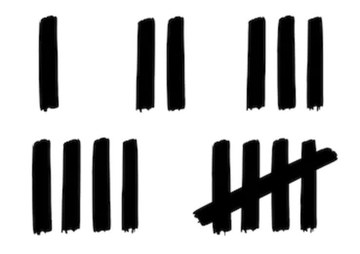

# Elliott's Daily Challenges

You are doing great with Khan Academy!  You are learning the basics of computer programming.

But we are going to switch for a few days and have you review some Chinese stuff.  You can keep on working on
Khan Academy if you want but it's important for you to do the Chinese review that Mrs. Walter gave you.

### Wednesday, September 2

1. Watch [this video](https://www.youtube.com/watch?v=WWqh44JXQRg) to review pinyin.  Be sure and pause the video and make the sounds out loud!
2. Go to [the pinyin practice page](https://www.yoyochinese.com/chinese-learning-tools/Mandarin-Chinese-pronunciation-lesson/pinyin-chart-table).
3. Set a timer in Alexa for 10 minutes.
4. Practice each sound in the rows from 'a' to 'er'.
5. Count each sound by making a stroke on a paper.
   
6. When the timer goes off, make a note of how many sounds you were able to practice and send them to me.

### Thursday, September 3

1. Watch [Part 1](https://youtu.be/gY82wOxpi-0) of the video on stroke writing from Mrs. Walter.
2. Watch [Part 2](https://www.youtube.com/watch?v=o2tm8BCudXs) on stroke writing from Mrs. Walter.
3. Set a timer on Alexis for 10 minutes.
4. Practice by writing characters from the video using the practice paper I printed out.
5. Bring me your work.

### Friday, September 4

1. Go to [the pinyin practice page](https://www.yoyochinese.com/chinese-learning-tools/Mandarin-Chinese-pronunciation-lesson/pinyin-chart-table).
2. Set a timer in Alexa for 15 minutes.
3. Practice each sound in the rows from 'i' to 'o'.
4. Count each sound by making a stroke on a paper.
5. When the timer goes off, make a note of how many sounds you were able to practice and send them to me.

### Saturday, September 5

1. Go to [the pinyin practice page](https://www.yoyochinese.com/chinese-learning-tools/Mandarin-Chinese-pronunciation-lesson/pinyin-chart-table).
2. Set a timer in Alexa for 15 minutes.
3. Practice each sound in the rows from 'ong' to the bottom of the page.
4. Count each sound by making a stroke on a paper.
5. When the timer goes off, make a note of how many sounds you were able to practice and send them to me.

