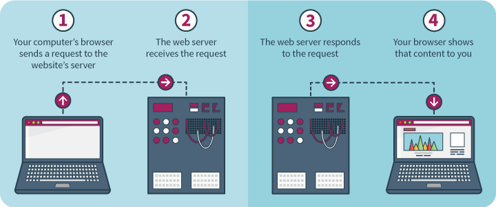

# Elliott's Daily Challenges

So far we have learned about several commands:

* `ls` for looking at a list of files
* `pwd` for showing what directory you are in
* `cd` for changing the current directory
* `yes` for silly stuff
* `cat` for printing out contents of files

We've also learned about "commands" and "input" and "output".

This week we are going to learn about the internet.

### Monday, June 29

Watch [this video](https://www.khanacademy.org/computing/computer-science/computers-and-internet-code-org/internet-works-intro/v/what-is-the-internet) from Khan Academy.

1. What person or organization is in charge of the internet?
2. What is "net" short for in the word "internet"?
3. Internet Addresses are unique numbers used to identify devices on the internet that send and receive data.  They consist of 4 numbers separated by three dots. You've probably seen them.  They look like: `192.168.16.120`. Each of the four numbers go from 1 to 255.  How many different internet addresses are possible?

Send me your answers in an email.

### Tuesday, June 30

This diagram shows how data is sent between two computers. 

This image itself is data that is sent across the internet.  Your computer
sent a request for this image to a computer named bkayser.github.io.
That computer returned this image, but not as a single blob of data.
Instead the image was divided into smaller "packets" and sent back to
your computer through diffent routers.  Once your computer received all of the packets they were "reassembled" to make this image.

1. What is the reason the data would be broken up into smaller packets before being sent back?  Are there any disadvantages to doing that?
2. You can see there are many different paths between the two computers, through many different routers.  Can you think of a reason why this would be better than having exactly one path between two computers?

You don't need to email answers.  Find your brother and come discuss your answers with me.

### Wednesday, July 1

Here is an illustration of how web browsers work.

This page that you are looking at right now contains data that is stored on a server called "bkayser.github.io".

In Step 2 you sent a "URL" to the web server to tell it what data you wanted.  In Step 3 the computer returned the exact data (web page) you wanted to look at.

Here is what the URL looks like:

    https://bkayser.github.io/DailyChallenge/elliott.html

There are three main parts to a URL:

* The protocol: `https:` tells the computer what language it wants to use to communicate with the server.  It's almost always `http` or `https`.
* The server: `bkayser.github.io`  This is the name of the computer where a program is running called a web server that will have your data.  This is a "hostname" or "server name" or "server address".  Sometimes you can use an IP address instead of a server name.
* The web page name: `/DailyChallenge/elliott.html`.  Servers store many pages.  This tells the server exactly what page you want to look at.

Email me the answer to number 5 below.  Then get your brother and come find me and I will ask you questions about the other 4 things you observed.

1. Change the protocol from "https" to something totally random.  What happens?
2. Change the protocol from "https" to "ftp".  FTP stands for "File Transfer Protocol".  What happens?
3. Now open up a new web page, anywhere.  Pick your favorite site.  Change the server name to "example.com".  What happens?
4. Change the server name to "elliottissluggy.com".  What happens?
5. Open the web page [http://example.com/nothinghere.com](http://example.com/nothinghere.com).  Then open the page [http://furrynightmare.com/nothinghere.com](http://furrynightmare.com/nothinghere.com).  Both pages show "404 errors".  What is a 404 error?  Look it up using google if you need to.

### Thursday, July 2

You don't need to email me.  Come find me when you succeed on the last step, or find me if you need help.

1. Open Chrome on any computer.
2. Go to the webpage [http://www.yutz-equitation.com/](http://www.yutz-equitation.com).
3. Look at the web page tab at the top of the window, where it displays the name of the web page.  What is this web page called?
3. Read everything up to "EXERCISE".  Don't bother with the exercise.
4. Under the *View* menu open *Developer -> Developer Tools*.
5. Find the *Elements* tab and select it.

Now you are looking at the special data nerd tool for looking at web pages.  The *Elements* section shows you all the tags on your web page.  But they are all collapsed.  You can expand any element by clicking on the little triangle in front of it.

Now you are going to edit this web page.

1. Expand the `<body>` tag.  Then make sure the `<html>` tag underneath is expanded.
2. Find the `<title>` tag.  Inside you should see the name of the webpage.
3. Click on the name of the webpage.  Try changing it.  Type in anything you want and hit return.

Did anything change?  Look at the tab at the top of the browser window that has the page.  What is the name of the page now?

