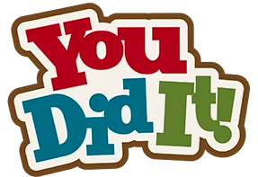
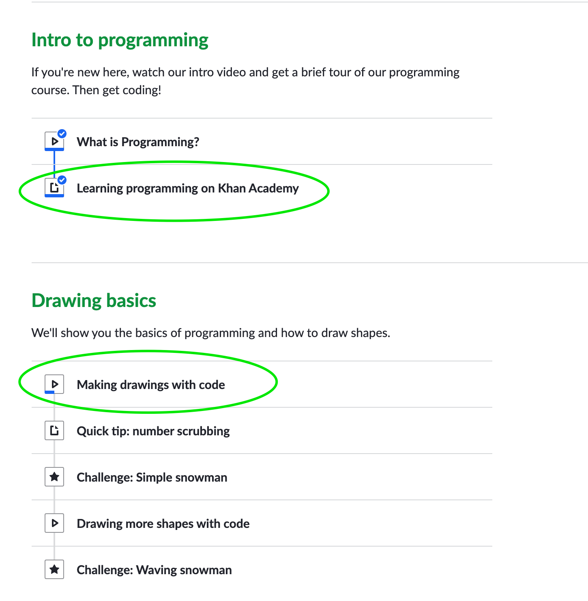
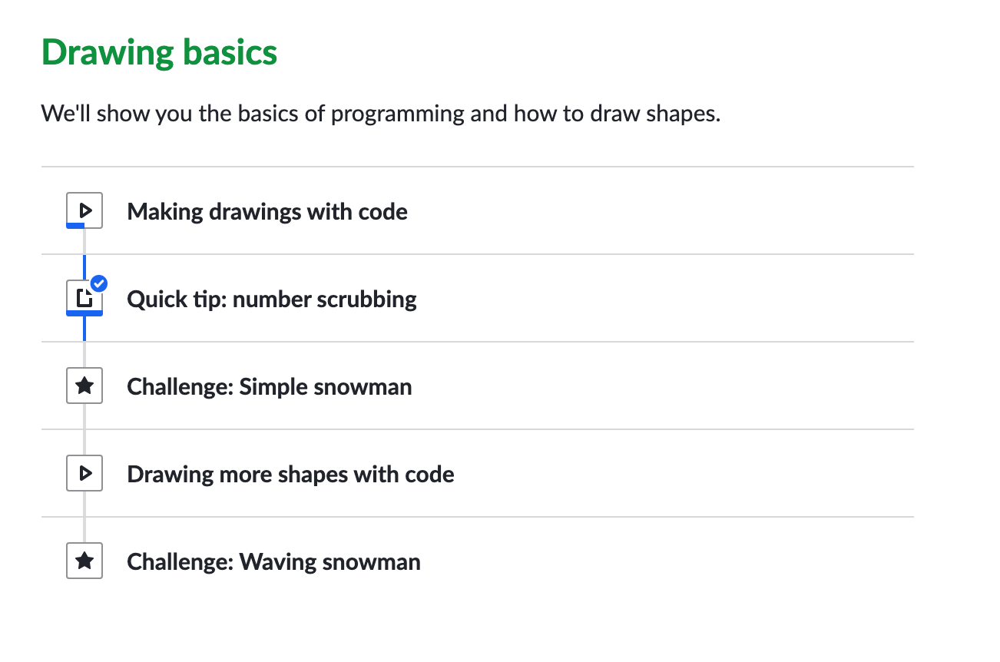

# Elliott's Daily Challenges

Congratulations!  You've been doing daily challenges for a month!  You are becoming a Unix expert!

Last week we learned more about input, output, and pipes.  You learned how to create a "pipeline" of data using
the `|` operator.

### Monday, July 13

You don't need to email me today.  Just find me when you are done and show me what you learned.

You already know how to use the `cat` command to look at the contents of a file.  Today you're going to learn a new command for looking at files.  Rather than looking at a large file all at once, it's better to "page" through the file, looking at one page at a time.  Your new command will help you with that.

1. Open up a terminal and cd to the `fun` directory.
2. Type `cat quotes.txt`.
3. Type `less quotes.txt`.
   The `less` command is similar to `cat` but with one big difference: _it only shows one page at a time_.  To see the next page, hit the space bar.
4. Keep hitting the space bar until you've gone through all the quotes.
5. Type `q` to quit.

The `less` command not only lets you go through text page by page, but you can go forward and backward.
1. Type `sort quotes.txt | less`
2. You can type `f` instead of the space bar to go forward.  You can type `b` to go back a page.  Use `f` and `b` to page down to the bottom of the quotes and then go back up to the top of the quotes.
3. Now type `/you`.  The `/` character means "search".  After you type `/you` you should see the word "you" highlighted on the screen.
4. Go forward and backward to see all the "yous" in the quotes.txt file.

The less command does many other things.  To see all the things you can do with `less` type in the letter `h`.  

#### Less is More

Why is the program to page through text called "less"?  It's because it's based on an older command called "more".  The "more" command also paged through text but it could only go forward and not backward, and it didn't have all the fancy commands that "less" has.  Try it!  Type "more" instead of "less".

### Tuesday, July 14

Congratulations, you've gone through and learned nearly all of the
basic unix commands.  You are on your way to becoming a true data
nerd!  The next step is to learn how to program computers.  Once you
know how to write a program, you can combine that with your unix
skills to build applications that actually do things like solving
complicated science problems or help people get their work done.

### Wednesday, July 15

Now we're going to focus on programming.  What type of programming are you interested in?

Watch these two videos and tell me which of these sound like courses you would like to pursue as part of your daily challenge.

1. Open a web browser on your office iMac and go to this page: [https://www.khanacademy.org](https://www.khanacademy.org).
2. Hit the "Log in" link and log in with the user name babyslug.  If you don't remember the password, think about your nickname + your favorite number.
3. Watch each of these videos:
   * https://www.khanacademy.org/computing/computer-programming/sql/sql-basics/v/welcome-to-sql
   * https://www.khanacademy.org/computing/computer-programming/programming/intro-to-programming/v/programming-intro
   * https://www.khanacademy.org/computing/computer-programming/html-css

Which of these topics sound the most interesting?

* Database Programming with SQL
* Programming with Javascript
* Building Web Pages with HTML

Come and discuss with me.

### Thursday, July 16

Today you're going to start the Khan Academy course on programming with Javascript.

It's best to do this on the Mac in your office, but if it's after 2:00 pm you'll have to use your Chromebook.

1. Open up the page to see the menu of lessons on the Javascript course:  https://www.khanacademy.org/computing/computer-programming/programming
2. Add this page to your bookmarks since you'll come here often.
3. Click on the lessons Learning Programming with Khan Academy and read the article.
4. Start the section on Drawing Basics by doing the lesson on Making Drawings with Code.
5. You can stop there or keep going and do more lessons.

Here are the lessons assigned today:

### Friday, July 17

Today I want you to finish the lesson on "Drawing Basics".  There are two challenges, a tip, and a video.

You already watched the first video that talked about functions and parameters.  Those are two of the most important concepts in programming!  If you are confused about what they are, go back and watch the first video again.

1. Make sure you are logged in to "babyslug"
2. Go to [the Drawing Basics](https://www.khanacademy.org/computing/computer-programming/programming/drawing-basics/pt/making-drawings-with-code) lesson.
3. While completing the lesson, create your own "spin-off".  This is how you store your own work.  Come find me and I'll help you with this if you are stuck or confused.
4. Complete all the parts of this lesson and show me what you did for the challenge.

