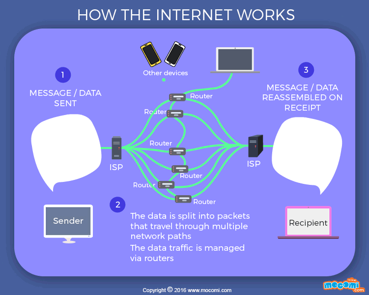

# Welcome to Felix’s Daily Challenge

Last week we learned about the apt package manager and a bit about IP Addresses.

### Monday, June 29

Watch [this video](https://www.khanacademy.org/computing/computer-science/computers-and-internet-code-org/internet-works-intro/v/what-is-the-internet) from Khan Academy.

Email me the answers to the following questions.

1. According to the video, where was the internet invented?
2. What is "net" short for in "internet"?
3. What countries are in charge of the internet?
4. Internet Addresses are unique numbers used to identify devices on the internet that send and receive data.  They are referred to as "IP addresses" or "IPv4 addresses". They consist of 4 numbers separated by three dots. Each of the four numbers go from 1 to 255.  How many different internet addresses are possible?

### Tuesday, June 30

This diagram shows how data is sent between two computers. 

This image itself is data that is sent across the internet.  Your
computer sent a request for this image to a computer named
bkayser.github.io.  That computer returned this image, but not as a
single blob of data.  Instead the image was divided into smaller
"packets" and sent back to your computer through diffent routers.
Once your computer received all of the packets they were "reassembled"
to make this image.

1. What is the reason the data would be broken up into smaller packets before being sent back?  Are there any disadvantages to doing that?
2. You can see there are many different paths between the two computers, through many different routers.  Can you think of a reason why this would be better than having exactly one path between two computers?

You don't need to email answers.  Find your brother and come discuss your answers with me.

