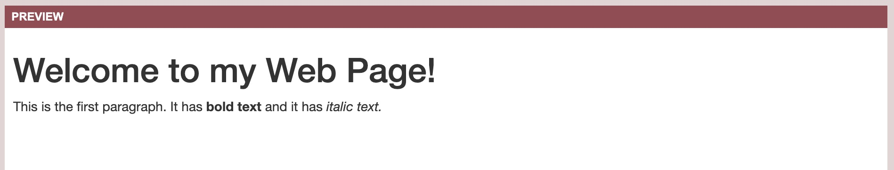

# Welcome to Felix’s Daily Challenge

Last week we learned about the apt package manager and a bit about IP Addresses.

### Monday, June 29

Watch [this video](https://www.khanacademy.org/computing/computer-science/computers-and-internet-code-org/internet-works-intro/v/what-is-the-internet) from Khan Academy.

Email me the answers to the following questions.

1. According to the video, where was the internet invented?
2. What is "net" short for in "internet"?
3. What countries are in charge of the internet?
4. Internet Addresses are unique numbers used to identify devices on the internet that send and receive data.  They are referred to as "IP addresses" or "IPv4 addresses". They consist of 4 numbers separated by three dots. Each of the four numbers go from 1 to 255.  How many different internet addresses are possible?

### Tuesday, June 30

This diagram shows how data is sent between two computers. 

This image itself is data that is sent across the internet.  Your
computer sent a request for this image to a computer named
bkayser.github.io.  That computer returned this image, but not as a
single blob of data.  Instead the image was divided into smaller
"packets" and sent back to your computer through diffent routers.
Once your computer received all of the packets they were "reassembled"
to make this image.

1. What is the reason the data would be broken up into smaller packets before being sent back?  Are there any disadvantages to doing that?
2. You can see there are many different paths between the two computers, through many different routers.  Can you think of a reason why this would be better than having exactly one path between two computers?

You don't need to email answers.  Find your brother and come discuss your answers with me.

### Wednesday, July 1

Here is an illustration of how web browsers work.

This page that you are looking at right now contains data that is stored on a server called "bkayser.github.io".

In Step 2 you sent a "URL" to the web server to tell it what data you wanted.  In Step 3 the computer returned the exact data (web page) you wanted to look at.

Here is what the URL looks like:

    https://bkayser.github.io/DailyChallenge/elliott.html

There are three main parts to a URL:

* The protocol: `https:` tells the computer what language it wants to use to communicate with the server.  It's almost always `http` or `https`.
* The server: `bkayser.github.io`  This is the name of the computer where a program is running called a web server that will have your data.  This is a "hostname" or "server name" or "server address".  Sometimes you can use an IP address instead of a server name.
* The web page name: `/DailyChallenge/elliott.html`.  Servers store many pages.  This tells the server exactly what page you want to look at.

Email me the answer to number 5 below.  Then get your brother and come find me and I will ask you questions about the other 4 things you observed.

1. Change the protocol from "https" to something totally random.  What happens?
2. Change the protocol from "https" to "ftp".  FTP stands for "File Transfer Protocol".  What happens?
3. Now open up a new web page, anywhere.  Pick your favorite site.  Change the server name to "example.com".  What happens?
4. Change the server name to "elliottissluggy.com".  What happens?
5. Open the web page [http://example.com/nothinghere.com](http://example.com/nothinghere.com).  Then open the page [http://furrynightmare.com/nothinghere.com](http://furrynightmare.com/nothinghere.com).  Both pages show "404 errors".  What is a 404 error?  Look it up using google if you need to.

### Thursday, July 2

1. Open Chrome on any computer.
2. Go to the webpage [http://www.yutz-equitation.com/](http://www.yutz-equitation.com).
3. Look at the web page tab at the top of the window, where it displays the name of the web page.  What is this web page called?
3. Read everything up to "EXERCISE".  Don't bother with the exercise.
4. Under the *View* menu open *Developer -> Developer Tools*.
5. Find the *Elements* tab and select it.

Now make the following changes to the web page and send me a screenshot or show me the changes.

1. Change the background color to yellow.  You'll need to figure out the RGB values for yellow and change the appropriate attribute in the elements section.
2. Change the title of the page to "Felix".

### Friday, July 3

Today you are going to write your first web page.

1. Have a look at [this webpage](sample.html).
2. Now you are going to write your own page.  Go to the page [https://htmlcodeeditor.com/](https://htmlcodeeditor.com/).
3. Erase what's in the editor on the left side and type in your own HTML.  See how what you type on the left appears on the right.
4. See if you can figure out exactly what to type so that your preview pane on the right looks like this:

Show it to me when you are done.

